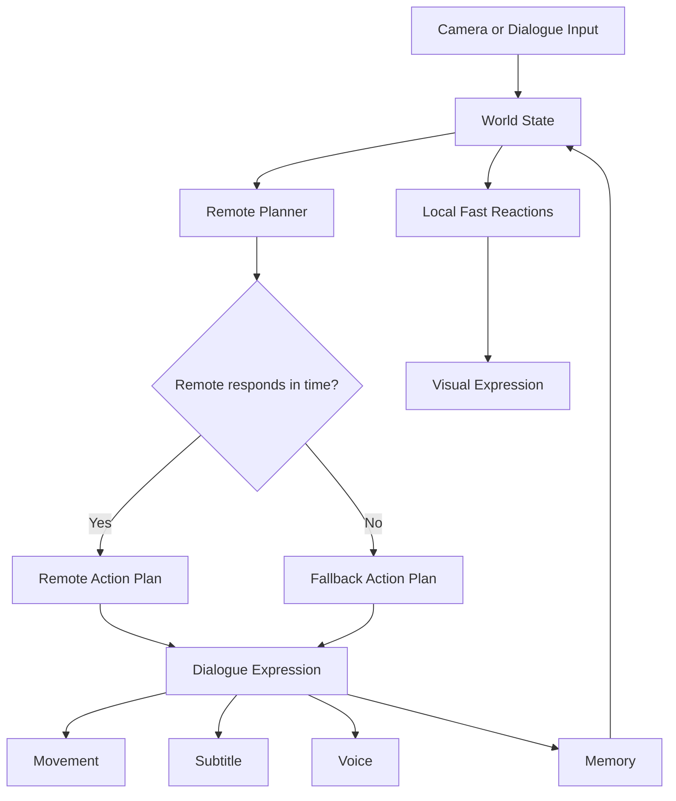
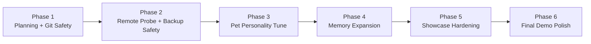
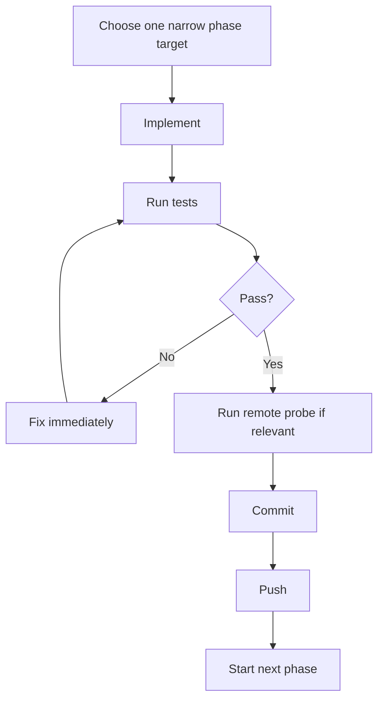

# HoloPet Agent Phase Playbook

Tanggal acuan: 14 Agustus 2026

Dokumen ini ditulis untuk agent coding lain agar bisa lanjut tanpa briefing ulang.

## Repo State

- Branch utama: `main`
- Remote utama: `origin`
- Repo target GitHub: `https://github.com/fauzan171/virtual-pet.git`

## Core Runtime Graph



## Delivery Graph



## Current Completed Phases

### Phase 1

- planning docs created
- repo initialized
- remote configured
- baseline pushed

### Phase 2

- remote probe mode added
- persistence backup added
- runtime backup ignored
- pushed

### Phase 3

- fallback pet dialogue tuned
- color preference memory added
- shorter, more companion-like Indonesian replies
- pushed

### Phase 4

- last_topic updates from common utterances
- favorite color and name recalled across dialogue branches
- last_topic recall and persistence tested
- pushed

### Phase 5

- probe output prints fallback summary and safety note
- HUD distinguishes REMOTE vs FALLBACK (LOKAL) with color
- fallback replies carry a soft local-brain note
- camera demo dialog runs on a worker thread so slow remote never blocks tracking
- pushed

### Phase 6

- idle chatter translated to warm Indonesian, energy-aware variants
- renderer hop arc makes movement transitions feel alive
- README gains a one-command showcase quick start
- pushed

### Phase 7

- visible-person segmentation and full pose anchors added through feet
- coordinate smoothing now uses the configured pose/hand/face values
- offsets and pet size adapt to the visible person's shoulder scale
- frame-rate-independent motion holds through tracking dropouts
- dialogue movement remains active beyond subtitle display time
- local, remote, tracking, and renderer share one anchor vocabulary

## Next Recommended Phases

The core roadmap (Phases 1-7) is complete. Remaining work is maintenance and
extension; the next target is hardening the existing microphone/STT/TTS turn
lifecycle, followed by authored character action clips and remote stress tests.

### Phase 8: Voice Turn Lifecycle

Goal:
- make microphone conversation feel intentional and recover safely

Tasks:
- prevent microphone capture while the pet is speaking
- expose listening, transcribing, thinking, and speaking state
- ignore empty transcripts and recover from per-turn failures
- keep every network path away from the camera thread

Done when:
- the pet cannot transcribe its own voice
- one bad voice turn does not kill later turns
- camera tracking remains responsive throughout a slow remote turn

Implemented:
- one `VoiceSession` owns microphone capture and TTS playback
- voice state is visible as listening, transcribing, thinking, speaking, or error
- playback completion plus an acoustic guard prevents self-transcription
- malformed remote replies and per-turn audio failures recover to safe local behavior
- OpenAI/remote dialogue stays on the worker while camera reactions stay local

### Phase 9: Authored Character Actions

Goal:
- replace generic animation labels with intentional enter/loop/exit action clips

Tasks:
- give perch, dash, spin, orbit, and landing their own timed transforms
- preserve Phase 7 motion continuity while actions transition
- add deterministic clip-progress tests before visual rehearsal

### Phase 4: Memory Expansion

Goal:
- make memory more useful for repeated interactions

Tasks:
- add memory recall for favorite color in more dialogue branches
- add `last_topic` updates from common utterances
- show memory-aware pet replies naturally
- add tests for recall behavior

Done when:
- memory persists
- recall paths tested
- no regression in current probe flow

### Phase 5: Showcase Hardening

Goal:
- make demo resilient for live use

Tasks:
- add explicit timeout/fallback note in probe output
- show remote/fallback source more clearly in UI
- make live dialogue non-blocking under slow remote conditions
- keep camera reactions snappy even during dialogue

Done when:
- remote slowness does not feel broken
- user can still see cute behavior under fallback

### Phase 6: Final Demo Polish

Goal:
- tighten showcase experience

Tasks:
- improve idle companion lines
- improve movement charm for shoulder/palm/nose transitions
- verify remote model choice again
- polish README demo steps

Done when:
- user can run one clean showcase command
- behavior feels intentional, not prototype-like

## Phase Execution Loop

For every phase:



## Mandatory Commands

### Before editing

```bash
git status --short --branch
python3 -m unittest discover -s tests
```

### During dialogue/runtime work

```bash
./run_holopet.sh --brain remote --probe-remote --utterance 'Namaku Jadi' --utterance 'ke bahu kanan' --utterance 'namaku siapa'
```

### For broader smoke

```bash
./run_holopet.sh --self-test --brain remote --utterance 'Namaku Jadi'
```

## Commit and Push Contract

Every stable phase must end with:

```bash
git add <changed files>
git commit -m "phase N: <goal>"
git push origin main
```

If a small cleanup is needed right after:

```bash
git commit -m "phase N follow-up: <cleanup>"
git push origin main
```

## Safety Rules

1. Never push with failing tests.
2. Never leave runtime artifacts tracked.
3. Keep `.gitignore` updated for runtime files.
4. Prefer small commits over giant mixed-phase commits.
5. If remote model is unstable, preserve fallback quality first.

## Runtime Truths

Current observed behavior:

- `remote` integration exists
- remote endpoint may be slow
- fallback currently carries the demo experience
- fallback must therefore stay polished and pet-like

## What To Optimize First

If time is limited, prioritize in this order:

1. fallback charm
2. memory usefulness
3. movement charm
4. remote reliability
5. voice realism

## Success Condition

This project is in good shape for showcase only when:

- test suite passes
- probe path passes
- movement is visible and cute
- memory is noticeable
- fallback does not feel like failure
- every completed phase is committed and pushed
