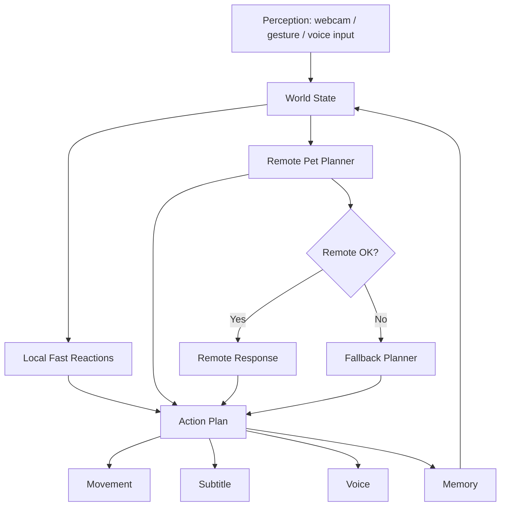
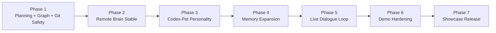
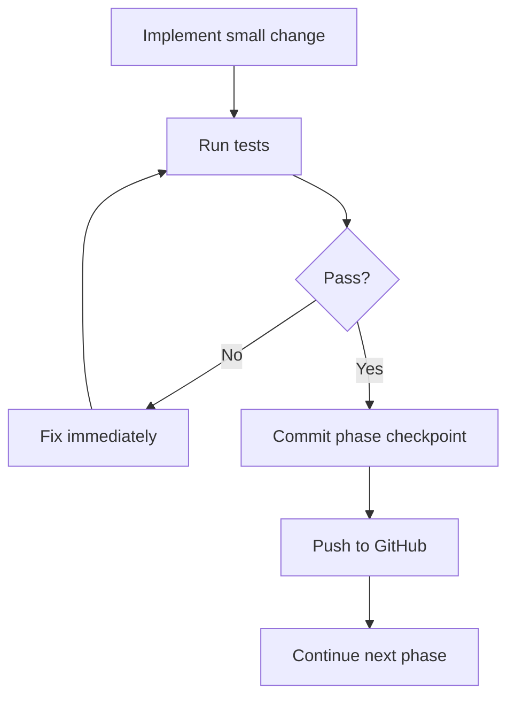

# HoloPet Phase Graph Plan

Tanggal kerja: 14 Agustus 2026

Dokumen ini adalah peta kerja agar pengembangan HoloPet berjalan seperti puzzle:

- pecah menjadi fase kecil
- selalu bisa dites
- selalu bisa rollback ke fase sebelumnya
- selalu bisa di-push bertahap
- aman untuk demo PPKMB dan showcase

## Target Utama

Membuat HoloPet terasa seperti pet companion yang hidup:

- bergerak lucu
- bicara singkat
- ingat user
- bisa fallback saat model lambat
- tetap aman untuk demo live

## Brain Graph

## Puzzle Graph

## Phase Breakdown

### Phase 1

Tujuan:
- buat planning
- buat graph
- siapkan workflow git aman
- pastikan bisa commit dan push per fase

Done jika:
- ada dokumen phase graph
- ada aturan commit per fase
- ada backup / rollback strategy

### Phase 2

Tujuan:
- remote brain langsung ke OpenAI-compatible endpoint
- timeout aman
- fallback cepat
- tidak bikin kamera macet

Done jika:
- `--brain remote` jalan
- source `remote/fallback/local` terlihat
- test suite lulus

### Phase 3

Tujuan:
- tone pet mirip codex pet
- singkat
- manis
- aktif bergerak

Done jika:
- reply 1-2 kalimat pendek
- perintah fisik memicu gerak + jawaban singkat
- tidak terdengar seperti chatbot umum

### Phase 4

Tujuan:
- memory aman dan makin berguna

Done jika:
- ingat nama
- ingat preferensi dasar
- ingat topik terakhir
- tetap persisten antar run

### Phase 5

Tujuan:
- dialogue loop live makin stabil

Done jika:
- stdin / script / self-test stabil
- bisa diperluas ke mic/STT real
- tidak merusak camera-only mode

### Phase 6

Tujuan:
- hardening untuk demo live

Done jika:
- timeout aman
- fallback jelas
- indikator source jelas
- no-freeze path tervalidasi

### Phase 7

Tujuan:
- final showcase build

Done jika:
- README rapi
- flow demo jelas
- semua fase penting sudah di-push

## Push Graph

## Safety Rules

1. Setiap fase harus punya checkpoint commit.
2. Kalau test gagal, perbaiki saat itu juga sebelum lanjut.
3. Jangan campur terlalu banyak perubahan dalam satu fase.
4. Push setelah tiap fase stabil.
5. Kalau remote model lambat, sistem harus tetap hidup lewat fallback.

## Git Strategy

Karena workspace saat ini belum berupa git repository:

1. sambungkan ke repo target
2. buat checkpoint awal
3. commit per fase
4. push per fase

Jika ada masalah:

- kembali ke commit fase sebelumnya
- lanjut dari checkpoint terakhir yang stabil

## Next Active Work

Fase aktif berikutnya:

- sambungkan workspace ini ke repo GitHub target
- buat workflow push bertahap
- lanjut implementasi fase berikutnya sambil test terus
